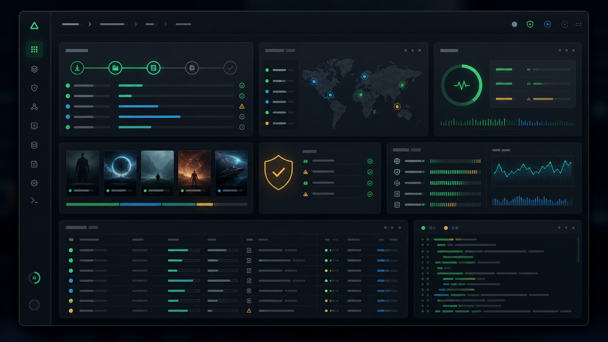

<!-- public-repo-status -->
> Status: Active Jellyfin plugin. Releases are published through GitHub Releases; issues use focused support templates.

# AniLiberty STRM Plugin for Jellyfin


AniLiberty STRM Plugin is a Jellyfin library reconstruction system for **AniLiberty** releases.
It turns AniLiberty API v1 signals into a governed Jellyfin media surface: STRM playback entries,
metadata, skip-control markers, artwork, favorites mirroring, and optional watch-progress sync.

The result is a controlled library pipeline rather than a loose folder dump: acquisition, reconstruction,
playback routing, manifest governance, telemetry, and release distribution all operate as one system.

---

## System Capabilities

- **Signal Acquisition Layer**
  - Detects API instability, rate-limit pressure, and ambiguous client identity.
  - Introduces a governed `HttpClient` pipeline with `ResponseHeadersRead`, retry/back-off, and a canonical
    `AniLibertyStrmPlugin/<version>` User-Agent for every AniLiberty request path.
  - Users see steadier catalog intake, explicit API courtesy, and fewer anonymous traffic patterns.

- **Context-Aware Reconstruction Core**
  - Detects catalog disorder: movie/series ambiguity, specials, fractional episode ordinals, API v1 year placement,
    image schema variation, and missing detail payloads.
  - Introduces a reconstruction policy for Jellyfin-ready folder structure, `SxxExx.strm`, `.nfo`, `.edl`,
    `.chapters.xml`, `.aniid`, and artwork.
  - Users see a Jellyfin library that behaves like curated media, including native Skip Intro markers on Jellyfin 10.11+.

- **Playback Proxy Rail**
  - Detects direct HLS exposure and redirect drift before playback traffic leaves Jellyfin.
  - Introduces upstream allow-list validation, playlist rewriting, and streaming segment/key delivery through
    Jellyfin without buffering entire media objects in memory.
  - Users see safer STRM playback routes with the original AniLiberty CDN structure kept behind a controlled proxy surface.

- **Mirror Governance Layer**
  - Detects metadata debris, stale generated files, and the dangerous boundary between plugin output and user-authored files.
  - Introduces `.aniliberty-strm-plugin/manifest.json`, generated-file markers, dry-run stale analysis, and opt-in deletion
    limited to manifest-managed files.
  - Users see metadata refreshes that preserve custom `.nfo` and artwork while exposing cleanup decisions before destruction.

- **Identity and Access Command Center**
  - Detects token leakage risk and OTP persistence risk inside the administration surface.
  - Introduces masked JWT display, explicit reveal/copy actions, login/password and OTP flows, and non-persistent OTP codes.
  - Users see account access handled as an intentional control surface rather than hidden configuration state.

- **Operational Command Center**
  - Detects silent sync failures, noisy debug streams, playback URL drift, and unclear task outcomes.
  - Introduces UI log levels, debug gating, playback diagnostics, progress reporting, and persisted log review.
  - Users see recovery signals, failure visibility, and review-ready operational state in the plugin page.

- **Distribution Rail and Quality Gates**
  - Detect Jellyfin ABI drift, package resolution drift, and release/catalog mismatch.
  - Introduce Jellyfin `10.11.0` package pins, committed lock files, locked restore in CI, package-resolution checks,
    synchronized release versioning, and automated catalog publishing.
  - Users see releases aligned to a declared Jellyfin ABI with a plugin manifest that remains in step with the build.

## Visual System Map


The pipeline is presented as six cooperating control layers: signal acquisition, context-aware reconstruction,
playback routing, mirror governance, operational command, and release quality gates. Each layer takes a specific
kind of media-library disorder and turns it into a controlled Jellyfin-facing outcome.



The administration surface is treated as a command center: authentication state, diagnostics, cleanup policy,
playback routing, and sync visibility stay in one operational frame instead of scattering across hidden files
and silent background work.

---

## 🚀 Requirements

|                 | Minimum / tested                                      |
|-----------------|-------------------------------------------------------|
| Jellyfin server | **10.11.0** (target ABI `10.11.0.0`)                  |
| .NET runtime    | `net9.0` (bundled with Jellyfin 10.11+ server builds) |
| OS              | Anything Jellyfin runs on (Windows / Linux / macOS)   |

Older Jellyfin 10.10 builds are **not** supported: the plugin is compiled against the minimum
Jellyfin 10.11.0 ABI (`Jellyfin.*` packages are pinned to `10.11.0`, not wildcard ranges).

### Tested Environment

Maintainer smoke checks currently cover:

- Native development on **Windows 10 Pro 2009** (`10.0.19041.6456`, x64).
- Docker smoke test on **Docker Desktop 4.51.0** for Windows.
- Docker Engine / Client **28.5.2**, Docker Compose **2.40.3**.
- Official image **`jellyfin/jellyfin:10.11.0`** with the plugin installed through the GitHub Pages repository manifest.

---

## 🔧 Installation

### Option A — via GitHub Pages repository (recommended)

1. Open **Dashboard → Plugins → Repositories → +** in Jellyfin.
2. Add repository URL:

   ```text
   https://queukat.github.io/AniLibriaStrmPlugin/plugins/manifest.json
   ```

3. Go to **Dashboard → Plugins → Catalog**, refresh the page.
4. Find **“AniLiberty STRM Plugin”**, click **Install**, restart Jellyfin.

The repository and manifest are built automatically by GitHub Actions from this repo.
The GitHub repository keeps the legacy `AniLibriaStrmPlugin` URL because the main branch still hosts the previous AniLibria plugin line; this branch and release line are branded as AniLiberty.

### Option B — manual ZIP

Manual ZIP install is the fallback path for offline installs or recovery. The repository install above is the normal path.

1. Download the latest `aniliberty-strm-plugin_*.zip` from this repository’s **Releases** page.
2. Stop Jellyfin.
3. Create a versioned plugin folder and unpack the ZIP contents directly into that folder.

   Windows default Jellyfin data path:

   ```text
   C:\ProgramData\Jellyfin\Server\plugins\AniLiberty STRM Plugin_2.0.0.10\
       AniLibertyStrmPlugin.dll
       Microsoft.Extensions.Http.Polly.dll
       Polly.Core.dll
       Polly.dll
       Polly.Extensions.Http.dll
       icon.png
       meta.json
   ```

   Official Docker image container path:

   ```text
   /config/plugins/AniLiberty STRM Plugin_2.0.0.10/
       AniLibertyStrmPlugin.dll
       Microsoft.Extensions.Http.Polly.dll
       Polly.dll
       Polly.Core.dll
       Polly.Extensions.Http.dll
       icon.png
       meta.json
   ```

   If Docker mounts `D:\jellyfin\config` to `/config`, the same folder on the Windows host is:

   ```text
   D:\jellyfin\config\plugins\AniLiberty STRM Plugin_2.0.0.10\
   ```

4. Start Jellyfin.

Do not unpack the ZIP into these places:

- `plugins\AniLiberty\`
- `plugins\configurations\`
- `AniLiberty STRM Plugin_2.0.0.10\aniliberty-strm-plugin_2.0.0.10\`
- the generated media output folder such as `/media/aniliberty-strm`

The plugin configuration file is stored separately by Jellyfin:

- Windows: `C:\ProgramData\Jellyfin\Server\plugins\configurations\AniLibertyStrmPlugin.xml`
- Docker: `/config/plugins/configurations/AniLibertyStrmPlugin.xml`

Keep that file private. It can contain account tokens, device IDs, and operational logs.

---

## First Launch Flight Check

AniLiberty STRM Plugin generates a Jellyfin-facing media surface inside the filesystem that the
Jellyfin server can see. In Docker that means the plugin must use the **container path**, not the
host path.

There are three different paths. Keep them separate:

| Path role | Windows example | Docker container example |
|-----------|-----------------|--------------------------|
| Plugin binaries | `C:\ProgramData\Jellyfin\Server\plugins\AniLiberty STRM Plugin_2.0.0.10` | `/config/plugins/AniLiberty STRM Plugin_2.0.0.10` |
| Plugin configuration | `C:\ProgramData\Jellyfin\Server\plugins\configurations\AniLibertyStrmPlugin.xml` | `/config/plugins/configurations/AniLibertyStrmPlugin.xml` |
| Generated media library | any folder Jellyfin can read, for example `D:\AniLibertyStrm\all` | `/media/aniliberty-strm/all` |

Example Docker volume contract:

```yaml
services:
  jellyfin:
    image: jellyfin/jellyfin
    volumes:
      - /srv/jellyfin/config:/config
      - /srv/jellyfin/cache:/cache
      - /srv/aniliberty-strm:/media/aniliberty-strm
```

Use `/media/aniliberty-strm` in the plugin and in Jellyfin library paths. The host path
`/srv/aniliberty-strm` is only the storage backing for Docker.

The **Browse** buttons on the plugin page are convenience controls, not a reliable server-path
discovery system. Browser security can expose only the selected folder name, not the full Jellyfin
server path. For Docker and headless servers, type the real server-visible path by hand. Use
**Append picked folder** only when the current text box already contains the parent path and you
want the picker to append one child folder name.

### Full Catalog and Favorites Are Separate Rails

AniLiberty STRM Plugin deliberately writes the full catalog and favorites into different output
roots:

- **All Titles STRM Path** is the full-catalog reconstruction rail.
- **Favorites STRM Path** is the personal favorites reconstruction rail.

The rails are operated separately:

- **Generate full catalog library** enables or disables the full-catalog rail.
- **Generate favorites library** enables or disables the favorites rail.
- **Generate AniLiberty STRM library** updates only the full-catalog root.
- **Generate AniLiberty STRM (Favorites Only)** updates only the favorites root and requires a valid
  AniLiberty token.

Running a scheduled task is not enough by itself. If the matching enable flag is off, or the matching
path is empty, that task exits without generating files. Save plugin settings before running either
task.

This is not duplication by accident. Favorites are often a smaller, authenticated operational
surface that you may want to scan, schedule, or expose separately from the full catalog. In Jellyfin
you can add them as two separate libraries, for example:

- `/media/aniliberty-strm/all`
- `/media/aniliberty-strm/favorites`

Do not point **All Titles STRM Path** and **Favorites STRM Path** at the same directory. Each output
root owns its own `.aniliberty-strm-plugin/manifest.json`; cleanup decisions are made per root. If
both rails share one folder, one rail can treat the other rail's generated files as stale, especially
when **Stale generated files** is set to `Delete managed stale files`.

Recommended first run:

1. Open **Dashboard → Plugins → AniLiberty STRM**.
2. Set **All Titles STRM Path** to a container-visible path such as
   `/media/aniliberty-strm/all`.
3. Configure **Jellyfin Playback Proxy Base URL** only if your playback devices need an explicit
   Jellyfin address. See the proxy rule below.
4. Keep **Generate full catalog library** enabled.
5. Save the plugin settings.
6. Open **Dashboard → Scheduled Tasks → AniLiberty**.
7. Run **Generate AniLiberty STRM library** manually.
8. After the rail finishes, add a Jellyfin media library that points to the same container path,
   for example `/media/aniliberty-strm/all`.

The first successful run creates the governance manifest
`.aniliberty-strm-plugin/manifest.json`, title folders, `.strm` playback entries, metadata,
artwork, and skip-control files where the upstream signal contains them.

For favorites, complete **AniLiberty authentication** first, set **Favorites STRM Path** to a
container-visible path such as `/media/aniliberty-strm/favorites`, keep **Generate favorites
library** enabled, then run **Generate AniLiberty STRM (Favorites Only)**. Add that favorites path
as a separate Jellyfin library if you want a dedicated favorites surface.

If the output directory stays empty, check these control points:

- The plugin path is the Docker container path, not the host path.
- The mounted folder is writable by the Jellyfin container user.
- The selected rail is enabled in plugin settings.
- The scheduled task matches the path you expect: full catalog task writes only **All Titles STRM Path**,
  favorites task writes only **Favorites STRM Path**.
- The scheduled task was run after saving settings.
- Favorites generation has a valid AniLiberty token.
- Playback clients can reach **Jellyfin Playback Proxy Base URL** if the playback proxy is enabled.
- **Last Task Logs** on the plugin page does not show API, permission, or path errors.

### Playback Proxy Base URL, plain rule

Leave **Jellyfin Playback Proxy Base URL** empty when playback already works from the Jellyfin server
or from a browser on the same machine. The plugin will let Jellyfin choose its local server address.

Set this field only when generated `.strm` playback must point at a specific Jellyfin address that
another device can reach. The value is the base Jellyfin URL as seen by the playback device, without
`/AniLibertyPlayback/hls` at the end.

Examples:

- Jellyfin runs natively on the same Windows PC where you test playback: leave it empty.
- Jellyfin runs on a Windows PC, but playback is on a phone, TV, or another computer:
  `http://192.168.1.10:8096`.
- Jellyfin runs in Docker on Windows with `8099:8096`, and playback is on a phone, TV, or another
  computer: `http://192.168.1.10:8099`.
- Jellyfin is published through a reverse proxy: `https://jellyfin.example.test`.

Do not use `localhost` for another device. On a phone, `localhost` means the phone. Inside Docker,
`localhost` means the container. For Docker, use a LAN IP or reverse-proxy hostname that the playback
device can reach; if that address is not reachable from the Jellyfin container too, leave the field
empty and use the auto-detected server address.

After changing this field, run **Generate AniLiberty STRM library** again so existing `.strm` files
receive the new proxy URLs.

### Mirror Governance, plain rule

The plugin writes a managed mirror manifest inside every output root:

```text
.aniliberty-strm-plugin/manifest.json
```

That manifest is the cleanup boundary. The first run that creates it is treated as a baseline and
does not delete anything. Later runs compare the previous managed file list with the new generated
file list.

Cleanup modes:

- `Keep` leaves stale managed files in place.
- `Dry-run log` is the default: it reports what would be removed, but keeps files on disk.
- `Delete managed stale files` removes only files already tracked by the manifest and then removes
  empty generated directories left behind.

Existing `.nfo` files and artwork that were not generated by this plugin are preserved. Generated
XML contains a `generated-by AniLibertyStrmPlugin` marker, and the manifest records managed STRM,
ANIID, EDL, chapter XML, NFO, artwork, release IDs, episode IDs, hashes, and timestamps.

---

## 🛠 Configuration

Open **Dashboard → Plugins → AniLiberty STRM**.

### Control Surface

| Field                        | Meaning                                                                 |
|------------------------------|-------------------------------------------------------------------------|
| **All Titles STRM Path**     | Dedicated root for the full-catalog reconstruction rail. Leave empty to disable. |
| **Favorites STRM Path**      | Dedicated root for the favorites reconstruction rail. Keep it separate from the full-catalog root. |
| **Preferred Resolution**     | HLS quality policy for STRM playback entries: 1080 / 720 / 480.        |
| **Generate favorites library** | Enables the favorites orchestration rail.                            |
| **Generate full catalog library** | Enables the full-catalog orchestration rail.                       |
| Pagination settings          | Signal pacing controls for catalog acquisition pressure.               |
| Logging options              | Operational Command Center controls: UI level, debug stream, playback diagnostics, and `Max UI log lines` retention. |
| Stale generated files        | Mirror Governance mode: `Dry-run log` by default; `Delete` is limited to manifest-managed files. |
| Proxy playback through Jellyfin server | Enables the Playback Proxy Rail for generated `.strm` URLs.   |
| Jellyfin Playback Proxy Base URL | Optional explicit Jellyfin base URL for clients that need a reachable LAN or reverse-proxy address. |
| View sync options            | Watch-state exchange policy for AniLiberty and the selected Jellyfin user. |

### Logging notes

- **UiMinLogLevel** controls what enters the Operational Command Center surface.
- **Enable debug logs (very noisy)**:
  - When **OFF**: DEBUG/TRACE messages are not stored in UI logs; per‑title progress logging is throttled.
  - When **ON**: UI logs become much more verbose (use it for troubleshooting).
- **Enable playback diagnostics logs**:
  - Adds per-episode diagnostics to *Last Task Logs*:
    selected HLS URL, normalized URL, existing/new `.strm` value, and a server-side HLS probe summary.
- **Max UI log lines**:
  - Limits how much operational history is retained in the plugin configuration. Default is `800`.
- **Stale generated files**:
  - `Dry-run log` reports managed files that disappeared from the latest API response.
  - `Keep` disables stale cleanup and keeps old managed entries visible in the manifest.
  - `Delete` removes only files listed in `.aniliberty-strm-plugin/manifest.json`; untracked user files are left alone.
- **Sync playback progress to AniLiberty**:
  - Pushes periodic progress signals for played `.strm` items.
  - **Sync step (seconds)** throttles outbound progress updates. Default is `30`, minimum accepted value is `5`.
  - **Send final progress on stop** sends one last update when playback stops.
  - If old libraries were generated before `.aniid` sidecars existed, run generation again to create mapping files.

### Watch-State Exchange

AniLiberty STRM Plugin has two watch-state rails:

- **Jellyfin → AniLiberty push**
  - Enabled by **Sync playback progress to AniLiberty**.
  - Watches Jellyfin playback events for generated `.strm` episodes.
  - Uses nearby `.aniid` sidecars to resolve AniLiberty episode IDs.
  - Sends progress to `/accounts/users/me/views/timecodes`.
  - Marks an episode watched when Jellyfin reports completion or the playback position reaches roughly the end of the runtime.

- **AniLiberty → Jellyfin pull**
  - Run manually through **Sync AniLiberty watch progress to Jellyfin** in Scheduled Tasks.
  - Requires a valid AniLiberty token.
  - Uses `AniLibertyViewSyncJellyfinUserId` when it is set.
  - If the server has exactly one Jellyfin user and the field is empty, that user is selected automatically.
  - If the server has multiple users, set the Jellyfin user id explicitly.

### AniLiberty authentication

At the bottom of the config page there is an **“AniLiberty Authentication”** section.

You have two flows:

1. **Login + password**
   - Enter your AniLiberty **e‑mail** and **password**.
   - Press **Log In**.
   - On success, the Command Center receives a JWT token and stores it as
     `AniLibertyToken`. The token is masked in the *Token* box unless you reveal it.

2. **OTP flow**
   - Press **Start OTP** – the plugin requests a one-time code for your device id and shows it for the current flow only.
   - Enter the received code into the OTP field.
   - Press **Sign In** to exchange the code for a JWT and store it.

The token and device id are retained in the plugin configuration and reused by:

- **Favorites task** – to fetch `/accounts/users/me/favorites/releases`.
- Any future authenticated API calls.

You can also refresh, copy, or clear the token from the same page.

---

## Orchestration Rails

Three orchestration rails appear under **Dashboard → Scheduled Tasks → AniLiberty**:

1. **Full Catalog Reconstruction Rail**
   - Acquires the complete AniLiberty catalog signal from `/anime/catalog/releases`.
   - Requires **Generate full catalog library** to be enabled.
   - Applies `AllTitlesPageSize` and `AllTitlesMaxPages` as acquisition pressure controls.
   - Produces STRM playback entries, metadata, skip markers, thumbnails, and optional chapters
     under **All Titles STRM Path**.
   - Does nothing when **All Titles STRM Path** is empty.
   - By default runs **once per day**.

2. **Favorites Reconstruction Rail**
   - Requires a valid `AniLibertyToken`.
   - Requires **Generate favorites library** to be enabled.
   - Converts the authenticated favorites signal into the same governed media surface under **Favorites STRM Path**.
   - Does nothing when **Favorites STRM Path** is empty.
   - Has no default trigger; you can enable and schedule it as you like.

3. **Watch-State Recovery Rail**
   - Manual rail with no default trigger.
   - Imports AniLiberty timecode state into a selected Jellyfin user profile.
   - Requires:
     - valid `AniLibertyToken`
     - `AniLibertyViewSyncJellyfinUserId` in plugin settings
   - Uses `.aniid` sidecar mapping generated near `.strm` files.

After saving settings you can run rails manually or let the scheduler operate them.

---

## 🏗 Build from source

```bash
# clone
git clone https://github.com/queukat/AniLibriaStrmPlugin.git
cd AniLibriaStrmPlugin

# restore, build & test
dotnet restore --locked-mode
dotnet build -c Release --no-restore
dotnet test  -c Release --no-build

# package with JPRM (build.yaml is already included)
jprm build .
# or use the provided GitHub Actions workflows (see .github/workflows)
```

The repository already contains `build.yaml` and CI workflows that:

- Compile the plugin for **net9.0 / Jellyfin 10.11.0 ABI**.
- Restore packages from committed lock files and verify `Jellyfin.*` packages remain pinned to `10.11.0`.
- Package it together with dependencies (`Polly`, `Microsoft.Extensions.Http.Polly`, `icon.png`).
- Publish the ZIP and `manifest.json` to GitHub Pages.

---

## 🔁 Release Automation

The repository uses two workflows:

- `.github/workflows/nightly.yml`
  - Trigger: every push to `aniLiberty-v2` (plus manual `workflow_dispatch`).
  - Builds the plugin and updates a moving prerelease with tag `nightly`.
  - Replaces assets in that single prerelease (no new tag per commit).

- `.github/workflows/release.yml`
  - Trigger: push to `aniLiberty-v2` where the **head commit message starts with `release:`**, or manual `workflow_dispatch`.
  - Bumps patch part of 4-part version (`X.Y.Z.W`) in `build.yaml` and the project assembly/package version.
  - Creates tag `vX.Y.Z.W`.
  - Creates GitHub Release with generated notes + commit summary since previous stable tag.
  - Updates `gh-pages/plugins/manifest.json` and publishes release asset + checksum.
  - Updates and publishes `CHANGELOG.md`.

### Version source of truth

- Version is stored in `build.yaml` (`version: "X.Y.Z.W"`).
- Stable release bumps the **4th part** (`W`) by default.
- Manifest/catalog version and assembly informational version are produced from the same release version and kept in sync automatically.

### Manifest and changelog visibility in Jellyfin

- Plugin catalog manifest is published to:
  - `https://queukat.github.io/AniLibriaStrmPlugin/plugins/manifest.json`
- For stable releases CI updates manifest fields for the new version:
  - `version`
  - `sourceUrl`
  - `checksum`
  - `changelog` (summary + links)
- Additional links are added in manifest version entry:
  - `releaseUrl`
  - `changelogUrl`
- Public changelog is published to:
  - `https://queukat.github.io/AniLibriaStrmPlugin/CHANGELOG.md`

### How to force stable release

1. Push your changes to `aniLiberty-v2`.
2. Ensure the last pushed commit message starts with `release:`.
3. CI does the rest: bump version, tag, release, manifest, changelog.

Example commit message:

```text
release: fix Android TV playback diagnostics and manifest sync
```

---

## 🧯 CI Troubleshooting

- `release.yml` did not run:
  - Verify branch is `aniLiberty-v2`.
  - Verify the latest pushed commit message starts with `release:`.
- Tag push or commit push failed from Actions:
  - Check branch protection rules allow `GITHUB_TOKEN` to push tags/commits.
- Manifest not updated:
  - Check `gh-pages` branch exists and workflow has `contents: write`.
  - Creating a GitHub Release manually does not update `plugins/manifest.json`; run `release.yml` (push `release:*` commit or use `workflow_dispatch`).
- Jellyfin catalog shows old data:
  - GitHub Pages cache/refresh delay can take a few minutes.
  - Re-open Plugins Catalog in Jellyfin and refresh repositories.

---

## 🤝 Contributing

Issues and PRs are welcome.  
Feel free to file bugs, request features or send patches.

---

## 📜 License

MIT © 2025 **queukat**
